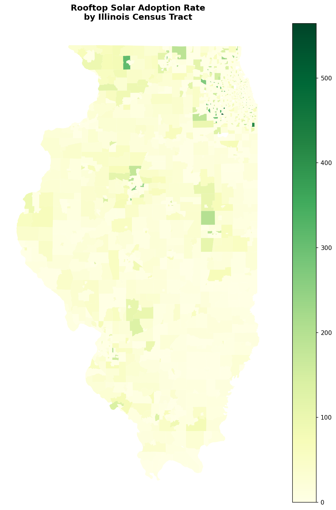
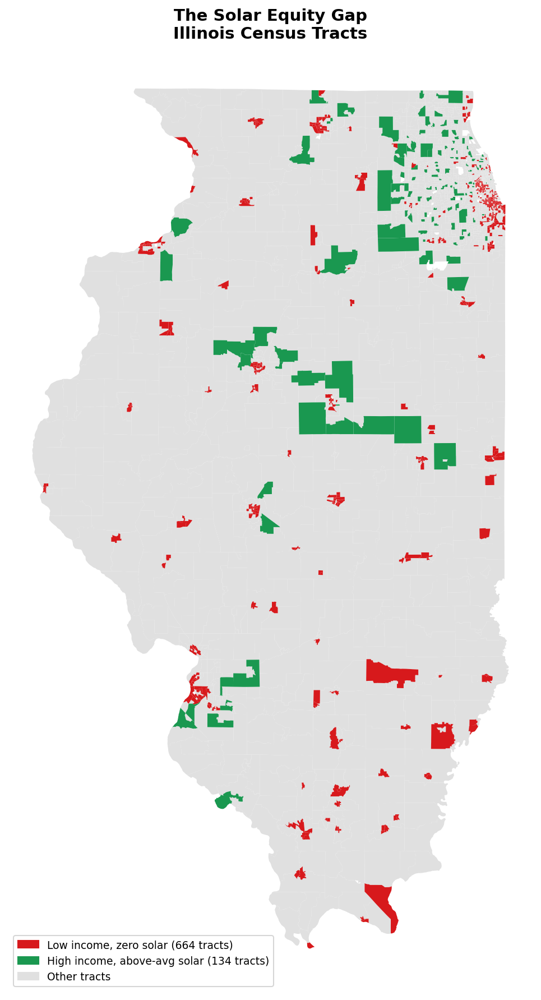
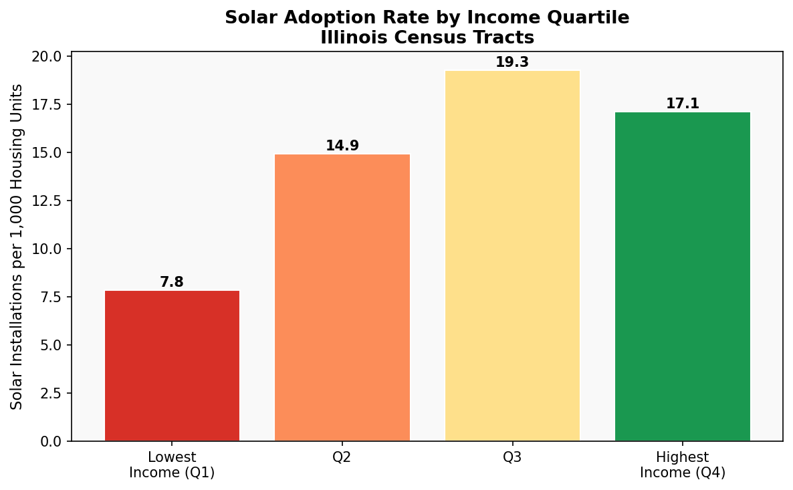
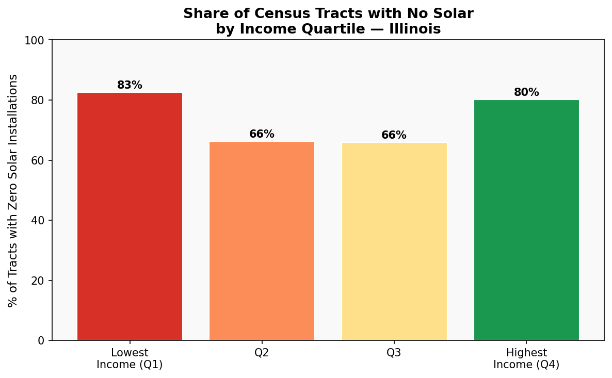

# Illinois Solar Equity Gap Analysis

Mapping rooftop solar adoption across 3,213 Illinois census tracts against income and race demographics to identify communities being left out of the clean energy transition.

---

## Key Findings

- **83%** of the lowest-income census tracts (664 of 804) have **zero** rooftop solar installations
- Highest-income tracts adopt solar at **2.2x the rate** of lowest-income tracts (17.1 vs. 7.8 installations per 1,000 housing units)
- An estimated **$52.9M in annual electricity savings** is inaccessible to low-income residents due to the adoption gap
- **14,936 installations are missing** from lowest-income communities compared to what equity would require
- Majority non-white tracts average **12.5 installations per 1,000 units** vs. 15.0 in majority-white tracts

---

## Maps & Charts

| Solar Adoption Rate | The Equity Gap |
|---|---|
|  |  |

## Data Sources

| Dataset | Source | Description |
|---|---|---|
| LBNL Tracking the Sun (Sep 2025) | [emp.lbl.gov](https://emp.lbl.gov/tracking-the-sun) | 79,100 Illinois rooftop PV installations |
| Census ACS 5-Year Estimates (2024) | [data.census.gov](https://data.census.gov) | Income, race, housing tenure by tract |
| TIGER/Line Shapefiles (2022) | [census.gov](https://www.census.gov/geographies/mapping-files/) | Illinois census tract boundaries |
| ZCTA Shapefiles (2022) | [census.gov](https://www.census.gov/geographies/mapping-files/) | ZIP code boundaries for spatial join |

---

## Policy Brief

The full policy brief with findings and recommendations is available in `brief/illinois_solar_equity_gap_brief.pdf`.
---

## Author

**Rishan Shah**  
University of Illinois Urbana-Champaign  